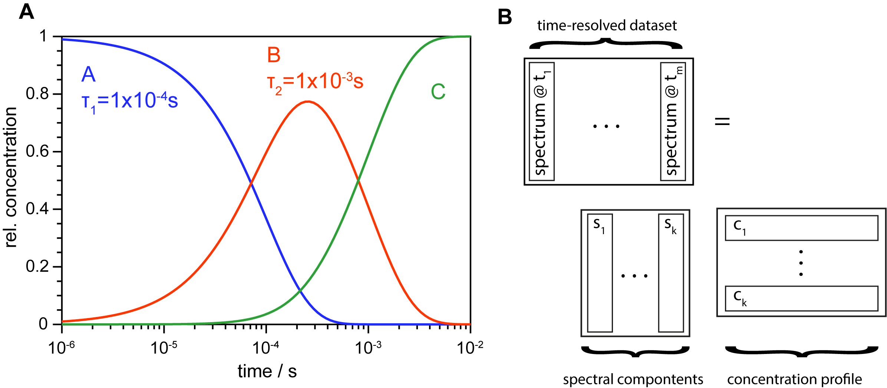

.. highlight:: rst

Global target analysis
==================

In contrast to SVD, global target analysis requires a model as fitting instruction. With this, models can be tested and parameters determined. Sticking to time-resolved spectral data, a model contains how spectral components evolve over time. This results in a system ordinary differential equations which can be (analytically) solved resulting in a concentration profile as shown in the image below.

In this toolbox, a model of sequential reactions is implemented (e.g. A -> B -> C -> ...). Back reactions are also implemented but are still experimental. The spectral components are also called *Evolution/Species associated spectra (EAS, SAS)* and both, the concentration profile and the EAS are obtained by global analysis.

The preferred method is to fit a specified number of abstract time traces which reduces drastically dimensionality and proved to be analytically very stable. The routine can be called via :py:meth:`trtoolbox.globalanalysis.doglobalanalysis`. Here, important parameters are ``tcs`` as a list with initial time constants and ``svds`` defining how many abstract time traces shall be fitted.

The returned objext is :py:class:`trtoolbox.globalanalysis.Results`.

| References:
| Lórenz-Fonfría, Víctor A., and Hideki Kandori. "Spectroscopic and kinetic evidence on how bacteriorhodopsin accomplishes vectorial proton transport under functional conditions." Journal of the American Chemical Society 131.16 (2009): 5891-5901.
|
| Van Stokkum, Ivo HM, Delmar S. Larsen, and Rienk Van Grondelle. "Global and target analysis of time-resolved spectra." Biochimica et Biophysica Acta (BBA)-Bioenergetics 1657.2-3 (2004): 82-104.
