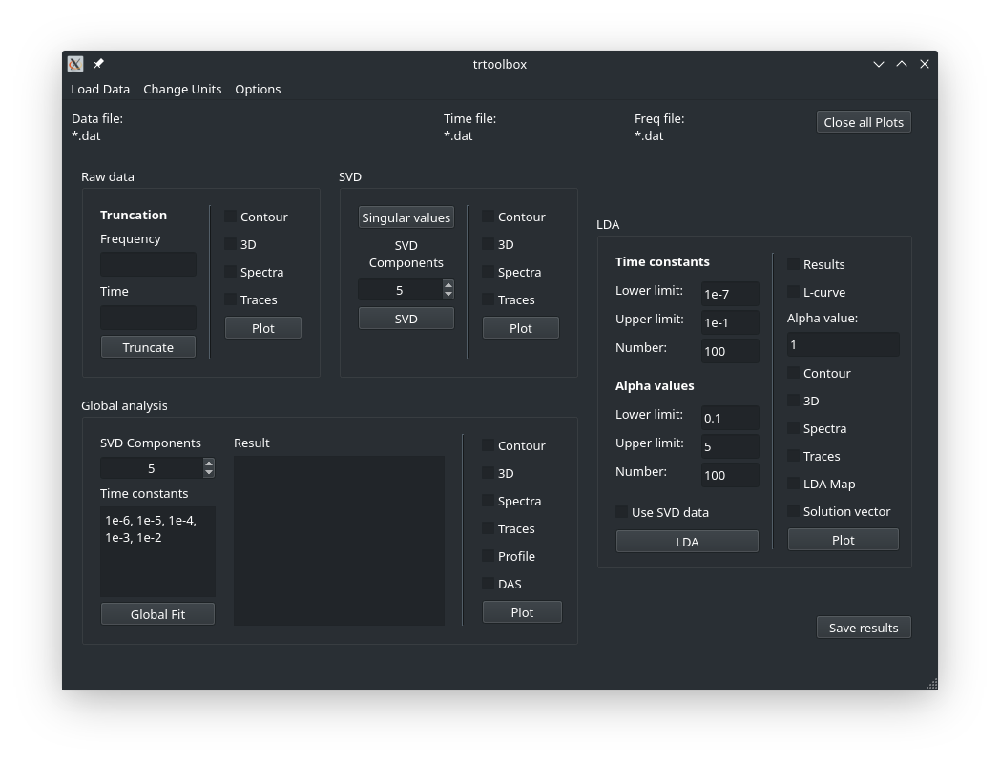

.. highlight:: rst

Using the GUI
=============

To start the GUI simply run *gui.py* in the trtoolbox folder. The two script files (*trtoolbox.sh* for bash/Linux and *trtoolbox.bat* for Windows) are a convenient way to activate an Anaconda environment and start the GUI. Do no forget to set the environment name and the Anaconda path in case of Windows.

    
The GUI is divided into different sections corresponding to the raw data, SVD, global analysis and LDA. Each section is further divided into a left pane where parameters for the method can be set and a right pane for plotting the results. For details of the different sections please read the dedicated chapters of this doc.

Data can be imported via the *Load Data* button in the menu bar. The GUI needs ASCII files but the delimiter can be set. Default is a comma. For training purposes, spectroscopic data can be generated and subsequently used for data analysis. 
