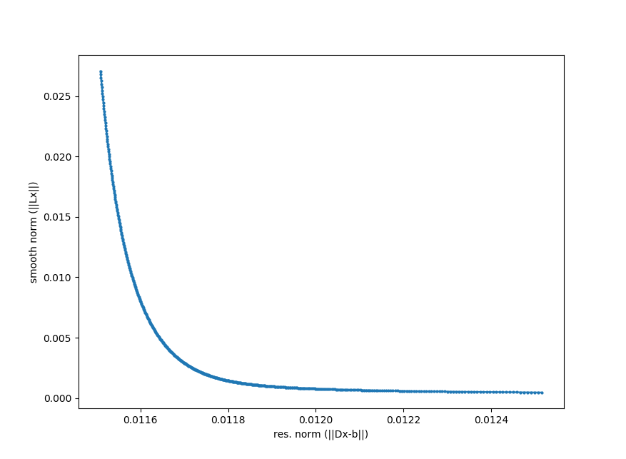

.. highlight:: rst

Lifetime density analysis
=========================

In contrast to global fitting where just a limited number of transitions is considered, LDA tries to explain the data with a discrete set of time constants (lifetime-density). Let :math:`\mathbf{D}` be a matrix where the ith column is filled with :math:`e^{-t/\tau_i}` where :math:`\tau` is the time constant. Further let :math:`\mathbf{A}` be the recorded data matrix. Then the data can potentially reconstructed by finding a matrix :math:`\mathbf{x}` solving

.. math::
    \mathbf{D}\cdot\mathbf{x} = \mathbf{A} \quad ,
    
which contains the amplitudes (pre-factors) for a certain expontential time course at a specific frequency. Above equation is a ill-posed problem with no unique solution. Applying Tikhonov regularization applies a penalty on large numbers on the solution :math:`\mathbf{x}` and thus prefers zero. In terms of minimization problem:

.. math::
    ||\mathbf{A}-\mathbf{D}\cdot\mathbf{x}|| + \alpha||\mathbf{L}\cdot\mathbf{x}|| \quad ,

with :math:`\alpha` as a constant which defines the balance between the residual (left) and smooth norm (right). The algorithm uses the identity matrix for :math:`\mathbf{L}` leading to the Euclidian 2-norm.

But how to choose :math:`\alpha`? For this, the so-called L-curve as shown below can provide some guidance. It plots the residual norm against the smooth norm. A good balance between the two are at the point with highest curvature.

    
LDA can be performed with the :py:meth:`trtoolbox.mylda.dolda` method. The returned objext is :py:class:`trtoolbox.mylda.Results`.

| Reference:
| Dorlhiac, Gabriel F., Clyde Fare, and Jasper J. van Thor. "PyLDM-An open source package for lifetime density analysis of time-resolved spectroscopic data." PLoS computational biology 13.5 (2017): e1005528.
