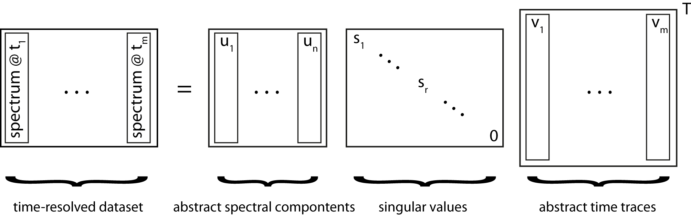

.. highlight:: rst

Singular value decomposition
============================

Dimensional reduction via SVD is widely used in machine learning but can also be used for image compression. Applying SVD to spectrocopic data can reduce noise significantly by choosing an appropiate number of singular values for reconstructing the data.

    
The image above illustrates what this means in terms of the matrices **U**, **S**, **V**. The matrix **U** contains abstract spectral components sorted by the significance represented by the singular values of **S**. It becomes clear that terms with a low singular value can be omitted due to their low contribution to the original dataset. Hence, the signal-to-noise ratio can be increased by choosing an appropriate cut-off value without loosing significant spectral information. Time information is stored in the **V** matrix which can be subjected to a global fitting procedure.

It is advised to run the :py:meth:`trtoolbox.mysvd.show_svs` routine prior the reconstruction of the data. It will show abstract time traces, spectra and how much variance is explained by singular values. Careful inspection of this information shall help to decide how many singular values should be used for recontruction with the :py:meth:`trtoolbox.mysvd.dosvd` routine. *n* is here the number of singular values. It can also be a list of values.

The returned objext is :py:class:`trtoolbox.mysvd.Results`.

| Reference:
| Lórenz-Fonfría, Víctor A., and Hideki Kandori. "Spectroscopic and kinetic evidence on how bacteriorhodopsin accomplishes vectorial proton transport under functional conditions." Journal of the American Chemical Society 131.16 (2009): 5891-5901.
